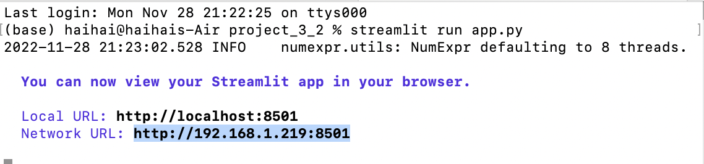
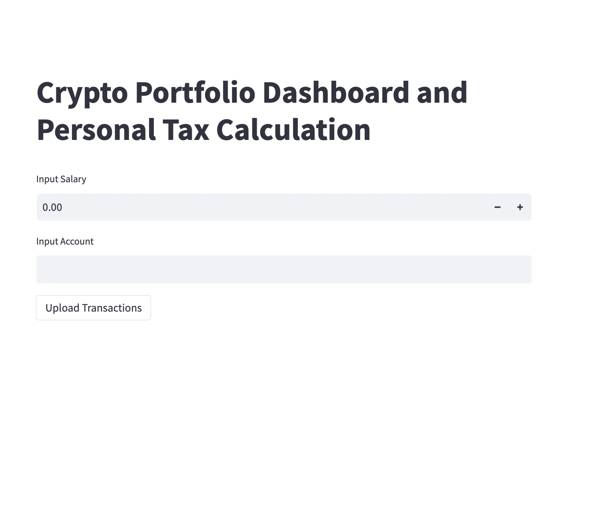
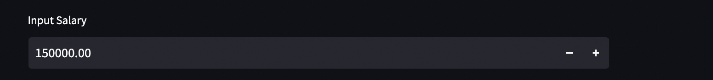
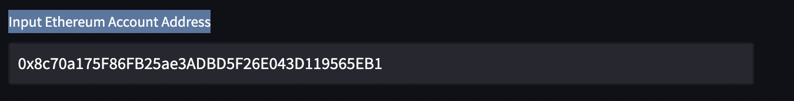
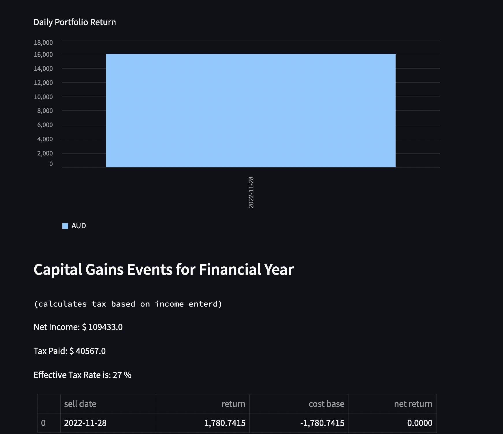

# Crypto Portfolio Dashboard and Personal Tax Calculation

 

# Overview: 

### A simple user interface (UI) that allows investors to input their salary, connect their trading accounts where the UI will automatically identify CGT events and pass total taxable income into our tax calculator (based on Australia’s progressive bracket tax structure).

 

 

## Context: Why do we need crypto income tax calculator ? 

 

>## The rise of blockchain technology, powering decentralised currencies known as ‘Cryptocurrencies’ has led to ~1bn people globally owning/investing in some form of it
>### (Editors Choice, 2022)

 

The challenge with this global trend is two-fold:

There is a particular concentration on new retail investors and it also;
Is challenging how government and financial agencies treat these investments in a tax context

 

Recent legislation in Australia has meant profit/loss from crypto investments is captured as a capital gain/loss (CGT) event as opposed to foreign currency gains.

For more information about cryptocurrent investment taxation, please visit: https://www.ato.gov.au/Individuals/Capital-gains-tax/

# Instructions and user story 
 

> ## “John has two income streams: he earns a $150k p.a. salary as a software engineer at Optiver, and earns income executing hundreds of ethereum trades each financial year. John wants to find a straightforward tool to find out his personal income tax based on Australian Taxation Regulations” 

 

### John's information:
 

Salary : **$ 150,000**

Ethereum Account Address: **0x8c70a175F86FB25ae3ADBD5F26E043D119565EB1**

 
 

## 1. Run **'streamlit run app.py'** in your terminal (IOS user) / command line (for Windows user), then copy the URL into your browser. 

 

## 2. Input annual, pre-taxed salary on streamlit interface 

 

## 3. Input our Ethereum account address 

## 4. View the results! 
 

### -   Daily portfolio view
### - Net income: income after tax
### - tax rate: tax rate based on total income 
### - Tax Paid: tax based based on total income

